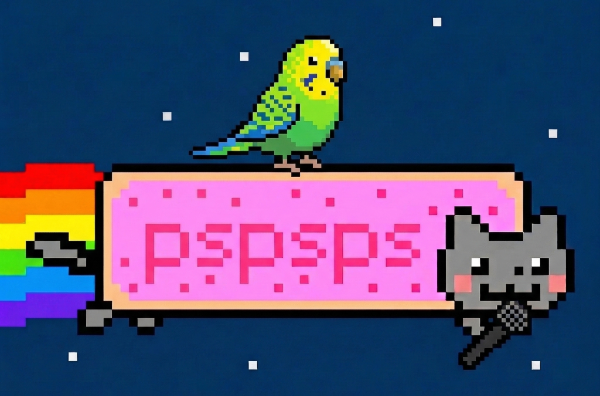
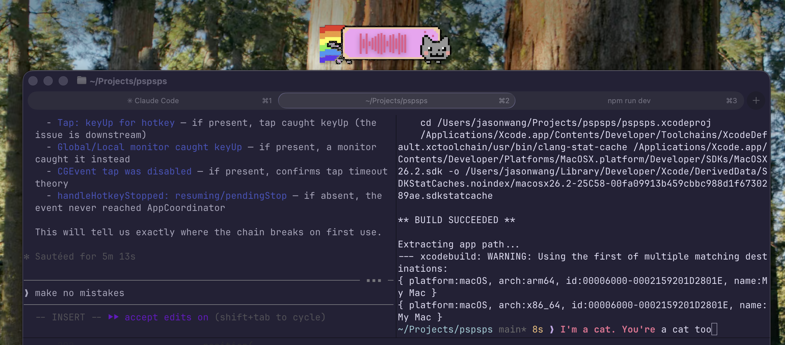
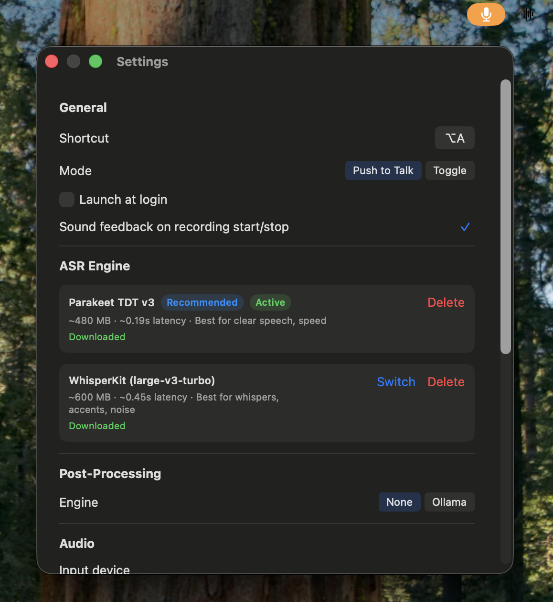

<p align="center">
  
</p>

<p align="center">
  <strong>Local voice-to-text for macOS</strong><br>
  Parakeet + Qwen3.5 post-processing
</p>

---

## pspsps 😸

**ASR engines**: [Parakeet TDT](https://github.com/FluidInference/FluidAudio) or [WhisperKit](https://github.com/argmaxinc/WhisperKit)

**Push-to-talk or toggle mode** with configurable hotkey

**Optional LLM cleanup**: route transcripts through a local [Ollama](https://ollama.ai) model like Qwen3.5 to fix punctuation and remove filler words (slow and not necessary IMO)

<p align="center">
  
  
</p>

Stuff I learned

- Something in the Settings menu kept crashing the app - Opus 4.6 went in circles for hours debugging it. I tried to provide backpressure/feedback by letting it write osascript to click the menubar, instead of me manually doing that and telling the model what happened. This wasn't getting anywhere, so I opened Antigravity, and Gemini 3.1 Pro oneshotted it.
- Another example of feedback - Opus kept getting the nyancat pixel art wrong, and I got tired of pasting screenshots into Claude, so had it write a pixel-grid-to-image generator so it could iterate w/o my involvement. This didn't work well either (bad at visuals?) so I had ChatGPT convert the nyan into a pixel grid, and Opus decided to make it a PNG.

## Setup

```bash
git clone https://github.com/your-username/pspsps.git
cd pspsps
open pspsps.xcodeproj
```

Build and run in Xcode (`⌘R`). On first launch, the onboarding flow will:

1. Download Parakeet (default, ~480 MB) or WhisperKit (~600 MB)
2. Grant Accessibility to type transcribed text into other apps
3. Grant Microphone to capture audio

## Development

```bash
# Debug build + run
./build_dev.sh

# Release build + run
./build_and_run.sh

# Run tests
xcodebuild test -project pspsps.xcodeproj -scheme pspsps -destination 'platform=macOS'
```
